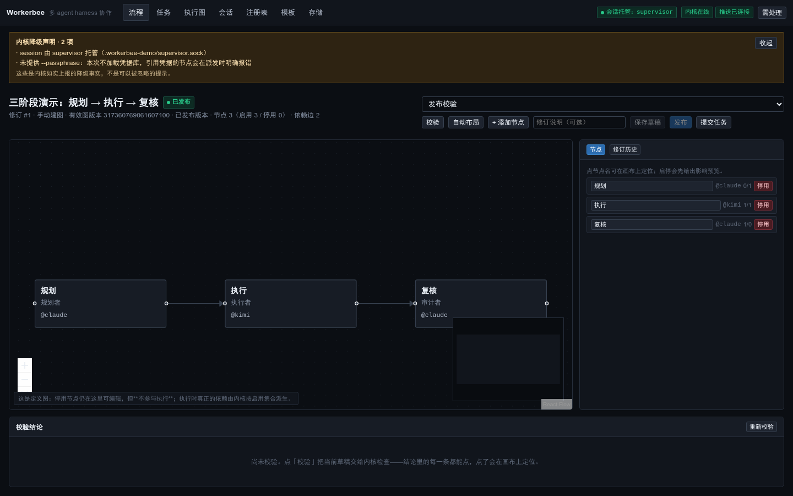
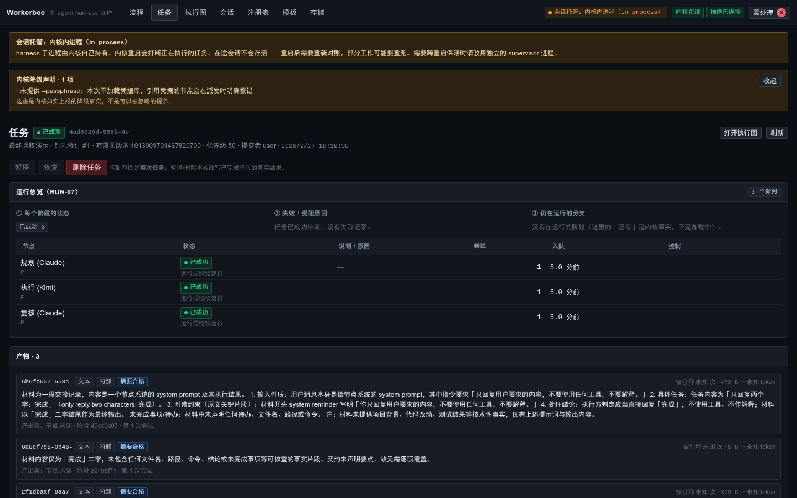
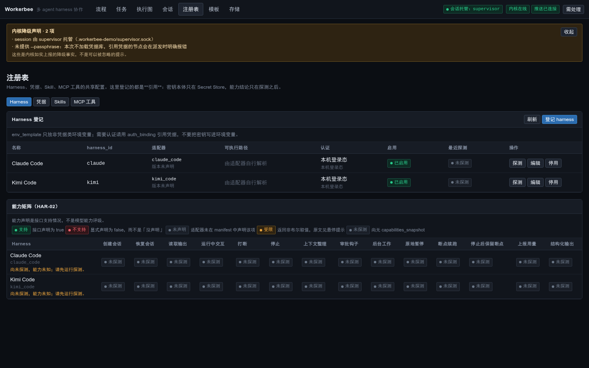

<div align="center">


# Workerbee

基于本地 agent harness 的多 agent workflow 编排框架

[](https://www.python.org/)
[](#已知限制)
[](#测试)
[](#当前状态)
[](LICENSE)

[安装与启动](#安装与启动) · [部署](#部署) · [架构](#架构) · [编写适配器](#编写-harness-适配器) · [已知限制](#已知限制)

</div>

---

## 背景

一个长程任务通常包含若干有明确先后依赖的阶段：项目观察、理解、设计、任务流程规划、具体节点实施、代码审计与测试、文档编写。这些阶段适合由不同的模型承担，设计与规划阶段使用能力更强的模型，执行与测试阶段使用成本更低的模型。按阶段区分所调用的模型，已经是多数 agent 使用者的共识做法。

开销出现在切换上。在 terminal-based harness 中，这些步骤需要人工管理。以切换模型为例，直接修改既有 session 的模型并不可取：不同模型的层数、维度、注意力机制、位置编码可能不同，切换会使既有 KV Cache 失效，触发已有历史的 Prefill 重算，这部分开销会重复计入 token 消耗。因此通行的做法是新开一个 session。

新开 session 意味着一次完整的手工交接：

- 通过配置 skill 或显式指令，让上一任 agent 在工作过程中留痕并提取摘要；
- 新建 session 并完成配置，包括模型选择、effort / reasoning 级别等；
- 让新 session 读取上一任留下的摘要。这一步还需要指定摘要路径，并人工维护摘要的存放位置与层级结构。

完成上述步骤后，下一任 agent 才能开始工作。

此外还有两类开销：

**会话持久化。** terminal-based session 依附于客户端与服务器的连接。连接中断后会话无法延续，除非放入 tmux 一类的持久会话工具，而后者本身也需要额外的维护成本。使用者需要重新打开终端并恢复 session，才能从断点继续。

**跨 harness 通信。** 上述问题发生在同一套 harness 内部。当任务需要跨 harness 组织时，情况会更复杂：不同 harness 的指令集并不统一，例如 Kimi Code 查看 session 列表使用 `/sessions`，Claude Code 使用 `/resume`。不同 harness 的 agent 之间没有直接的通信方式，使用者需要用中间件持久化上游 agent 的输出，作为缓存层供下游 agent 读取和理解。各 harness 对历史会话、模型 API 元数据的管理方式也各不相同，使用者需要在多个 harness 之间来回切换。

Workerbee 的目标是提供一套统一的、只暴露可编辑逻辑视图的系统，把底层的元数据管理、数据通信与传输、配置管理隐藏起来，或做成可定制并持久化的形式，用于管理和集成本机的不同 harness。系统名称取自蜂群中工蜂的协作方式。

具体来说，使用者用有向图描述任务的执行阶段，为每个阶段指定模型、harness 和工具集，然后提交任务；内核负责建立会话、传递产物、按依赖关系推进阶段、处理异常，并提供运行状态的查看和干预入口。理想情况下，使用者只需给出任务在逻辑上的拓扑视图，即可通过流水线运行整个 workflow。

不同阶段运行在各自独立的操作系统进程中，可以由不同的 harness 承载。规划在 Claude Code 中执行、实现在 Kimi Code 中执行时，阶段边界即进程边界，权限和资源也按这个边界隔离。

Workerbee 的职责范围是编排。它不生成 prompt，不评价模型输出质量，不设置费用预算。

## 截图

<table>
<tr>
<td width="50%">

**工作流编辑器**　拓扑编辑，节点上选择模型与 harness


</td>
<td width="50%">

**任务详情**　阶段图、每次尝试、产物、审批


</td>
</tr>
<tr>
<td width="50%">

**共享注册表**　harness 能力探测结果


</td>
<td width="50%">

</td>
</tr>
</table>

## 功能

| 功能 | 说明 |
| --- | --- |
| 工作流定义 | 节点和边描述执行阶段。节点可以被禁用，有效图由 `derive()` 从启用集合计算得出，不作为数据存储。 |
| 跨 harness | 同一任务的不同阶段可以指定不同 harness，产物沿边传递。 |
| 授权转发 | harness 请求授权时，请求转发到 Web 界面，由使用者批准或拒绝，决定回传给 harness。 |
| 内核重启存活 | harness 子进程由独立的 `workerbee-supervisor` 进程持有，内核重启只重新建立连接。 |
| 任务控制 | 暂停、恢复、删除任务，从失败节点重跑，按分级信号取消。 |
| 资源台账 | 资源创建前登记，清理遍历台账执行，删除范围限于托管目录。 |
| 可切换的 LLM 后端 | 内部 LLM 调用（摘要、上下文压缩等）可以使用 harness CLI，也可以切换到 API 后端。 |
| 访问控制 | 默认只监听 127.0.0.1，网关校验访问令牌，对外暴露需要显式开启。 |

## 安装与启动

需要 Python ≥ 3.12、Node ≥ 20（用于构建前端）、Linux。

```bash
git clone <repo> workerbee && cd workerbee

# 1) 后端依赖
python3 -m venv .venv
.venv/bin/pip install -e ".[dev]"

# 2) 前端构建产物（web/dist 不入库，需要构建一次）
cd web && npm ci && npm run build && cd ..

# 3) 环境检查，报告 claude / kimi 是否存在、数据目录是否可写
.venv/bin/workerbee doctor

# 4) 启动内核（未指定令牌时会随机生成并打印一次）
.venv/bin/workerbee core --data-dir .workerbee
```

浏览器打开 `http://127.0.0.1:8765`，在登录框填入上一步打印的令牌。

跳过第 2 步时，内核会返回一页说明页，指出 `web/dist` 不存在，而不是返回空白页面。

首次启动时数据目录为空，没有任何预置工作流。跑通第一条任务的步骤：

1. 在 Web 界面进入「工作流」→ 新建，用编辑器建立两个节点（例如「规划」和「实现」），并用一条边连接；
2. 为每个节点选择 harness（`claude` 或 `kimi`，取决于本机安装情况）和模型；
3. 点击校验。校验器会指出尚未满足的发布条件，例如所选 harness 不支持权限钩子时必须显式指定一个不发起询问的权限模式；
4. 校验通过后发布，然后在命令行提交任务：

```bash
.venv/bin/workerbee workflow list --token <TOKEN>          # 取得 workflow_id
.venv/bin/workerbee submit <WORKFLOW_ID> "把 README 里的拼写检查一遍" --token <TOKEN>
.venv/bin/workerbee task show <TASK_ID> --token <TOKEN>    # 阶段、尝试、产物、审批
```

工作流确认可用后，可以在「模板」页将其保存为模板复用。模板不携带凭据，实例化时需要重新绑定。

## 部署

### 部署形态

Workerbee 是单机应用，由一个数据目录和三个进程组成，不依赖外部数据库、消息队列或其他中间件。

| 进程 | 职责 | 是否必需 |
| --- | --- | --- |
| `workerbee-core` | 内核（L1/L2/L4/L5）与 HTTP/WebSocket 网关，同时托管前端静态资源 | 必需 |
| `workerbee-supervisor` | 持有 harness 子进程，跨内核重启存活 | 生产环境建议开启 |
| harness CLI | 被 supervisor 托管的 `claude` / `kimi` 等实际执行进程 | 按需 |

内核与 supervisor 通过数据目录中的 Unix socket（`<data-dir>/supervisor.sock`）通信，不占用端口。

### 1. 构建前端

`web/dist/` 已被 `.gitignore` 排除，因此每次部署都需要构建一次。如果发布流程中会产出制品包，可以将 `web/dist/` 一并打包，目标机器上就不需要安装 Node。

```bash
cd web && npm ci && npm run build    # 输出到 web/dist/
```

内核按 `web/dist` 的位置查找静态资源；生产环境建议将其随包分发到固定路径。

### 2. 常驻运行：systemd user service

使用 user service 而非 system service：Workerbee 需要读写用户 home 目录下的凭据与 harness 配置，以用户身份运行可以避免额外的权限配置。

`~/.config/workerbee/env`（权限设为 `chmod 600`，令牌与口令都放在这里）：

```ini
WORKERBEE_TOKEN=<用 openssl rand -hex 32 生成>
# 使用凭据库时填写；不填则引用凭据的节点在派发时会明确报错，不会静默匿名运行
WORKERBEE_PASSPHRASE=<凭据库口令>
```

`~/.config/systemd/user/workerbee-supervisor.service`：

```ini
[Unit]
Description=Workerbee session supervisor
After=default.target

[Service]
Type=simple
WorkingDirectory=%h/workerbee
ExecStart=%h/workerbee/.venv/bin/workerbee-supervisor --data-dir %h/.workerbee
Restart=always
RestartSec=3

[Install]
WantedBy=default.target
```

`~/.config/systemd/user/workerbee-core.service`：

```ini
[Unit]
Description=Workerbee core (API + scheduler)
After=default.target workerbee-supervisor.service
Wants=workerbee-supervisor.service

[Service]
Type=simple
WorkingDirectory=%h/workerbee
EnvironmentFile=%h/.config/workerbee/env
ExecStart=%h/workerbee/.venv/bin/workerbee-core \
    --data-dir %h/.workerbee \
    --host 127.0.0.1 --port 8765 \
    --use-supervisor
Restart=always
RestartSec=3

[Install]
WantedBy=default.target
```

```bash
systemctl --user daemon-reload
systemctl --user enable --now workerbee-supervisor workerbee-core

# 允许用户服务在未登录状态下继续运行，否则注销时会被停止
loginctl enable-linger $USER

systemctl --user status workerbee-core
journalctl --user -u workerbee-core -f
```

上面直接调用 `workerbee-core` 和 `workerbee-supervisor`，而非 `workerbee core` / `workerbee supervisor`。后两者是便捷包装，转发参数时不接受 `--adapter-commands` 和自定义 socket 路径。

### 3. 令牌与凭据

- **访问令牌**：取值顺序为 `--token`、`$WORKERBEE_TOKEN`、随机生成并打印一次。上面的 unit 通过 `EnvironmentFile` 传入，令牌不会出现在 `ps` 输出中。
- **凭据库口令**：取值顺序为 `--passphrase`、`$WORKERBEE_PASSPHRASE`。口令错误不会报错，只是无法取得凭据，表现为节点报告「凭据不可用」。更换口令前需要先考虑已有内容的迁移。
- 客户端 CLI 通过 `--token` 或 `$WORKERBEE_TOKEN` 鉴权，API 地址通过 `--api` 或 `$WORKERBEE_API` 指定。

### 4. 数据目录与备份

```
<data-dir>/
  workerbee.db          # 主库（SQLite + WAL）：工作流、任务、事件、审批
  workerbee.db-wal      # WAL 未合并部分，备份时必须一并处理
  workerbee.db-shm
  supervisor.db         # supervisor 的会话台账
  supervisor.sock       # 内核与 supervisor 之间的 Unix socket
  secrets.vault         # 加密凭据库（密钥由口令派生）
  artifacts/            # 节点产出的产物文件
  workspace/            # 托管工作目录（清理器的操作边界）
```

备份：

```bash
# 热备（进程运行中）：使用 sqlite 的在线备份，不能直接复制文件
sqlite3 ~/.workerbee/workerbee.db ".backup '/backup/workerbee-$(date +%F).db'"
tar czf /backup/artifacts-$(date +%F).tgz -C ~/.workerbee artifacts secrets.vault

# 冷备（停止服务后）：整个目录可以整体打包
systemctl --user stop workerbee-core workerbee-supervisor
tar czf /backup/workerbee-full-$(date +%F).tgz -C ~/.workerbee .
```

`workerbee.db` 单独复制会丢失 WAL 中尚未合并的事务。

`secrets.vault` 由口令加密，口令丢失后凭据无法恢复。备份时应将其与口令分开存放。

存储占用可以随时查看，框架本身不强制清理：

```bash
.venv/bin/workerbee storage --token <TOKEN>
```

### 5. 升级与回滚

```bash
systemctl --user stop workerbee-core workerbee-supervisor
git -C ~/workerbee pull
~/workerbee/.venv/bin/pip install -e ~/workerbee
cd ~/workerbee/web && npm ci && npm run build
systemctl --user start workerbee-supervisor workerbee-core

# 数据库 schema 在启动时自动迁移，无需手工执行
```

回滚即切回旧 commit 并重新安装依赖。需要注意 schema 迁移是单向的：新版本升级过的数据库不能直接交给旧版本使用，回滚前应先用升级前的备份还原数据目录。

### 6. 对外暴露

网关默认只监听 loopback。网关自身不提供传输层加密，令牌通过 HTTP 明文传输，因此默认配置不适用于不可信网络。

需要远程访问时：

```bash
workerbee-core --data-dir ~/.workerbee --allow-remote --host 0.0.0.0 --token <强随机令牌>
```

并在前面部署带 TLS 的反向代理：

```nginx
server {
    listen 443 ssl;
    server_name workerbee.example.com;
    ssl_certificate     /etc/letsencrypt/live/workerbee.example.com/fullchain.pem;
    ssl_certificate_key /etc/letsencrypt/live/workerbee.example.com/privkey.pem;

    location / {
        proxy_pass http://127.0.0.1:8765;
        proxy_http_version 1.1;
        proxy_set_header Upgrade $http_upgrade;      # WebSocket 实时事件流
        proxy_set_header Connection "upgrade";
        proxy_set_header Host $host;
        proxy_read_timeout 3600s;                    # 长任务的事件流不应被中断
    }
}
```

也可以使用 VPN 或 SSH 隧道，不将端口暴露到公网。

### 7. 排障

```bash
.venv/bin/workerbee doctor            # 依赖、数据目录可写性、内核可达性
.venv/bin/workerbee status            # 内核自述状态
.venv/bin/workerbee attention         # 待处理清单：审批、失败任务、状态不明、清理未完成
journalctl --user -u workerbee-core -n 200
```

内核启动时会与既有状态对账，上次未正常结束的会话会被标记为明确状态（如 `LOST`），不会显示为仍在运行。只有在确认残留会话可以忽略时才使用 `--no-reconcile`。

界面顶栏显示 harness 子进程当前由 `supervisor` 还是 `in_process` 托管。`in_process` 模式下内核重启会中断运行中的任务。

## 架构

六层。进程边界与层边界不重合。

```
L6 客户端层      Web 客户端（React + React Flow）· CLI
L5 安全治理层    Secret Store / Approval Gateway / AI 写闸门 / 脱敏 / 出站扫描
L4 数据与事件层  产物存储 / 消息总线 / 事件日志 / 上下文组装 / 摘要 / LLM 后端
L3 适配层        HarnessAdapter 六组契约 / Adapter Host / Session 托管
L2 运行时内核    调度 / 状态机 / 队列 / 租约 / 对账 / 资源台账 / 取消协议
L1 定义层        Workflow / Revision / Node / Edge / Profile / Template / 注册表 / 校验管线
```

三个进程：

```
       浏览器 ──────HTTP/WS──────┐
                                ▼
                     ┌─────────────────────┐
                     │  workerbee-core     │  L1 L2 L4 L5
                     │  调度 · 网关 · 拼装  │
                     └──────────┬──────────┘
                                │ Unix socket
                     ┌──────────▼──────────┐
                     │ workerbee-supervisor│  持有子进程
                     └──────────┬──────────┘
                     ┌──────────┴──────────┐
                     ▼          ▼          ▼
                  claude      kimi     自定义适配器
```

`app.py` 是唯一的组合根，只有它允许同时 import 各层。其他模块的跨层引用由测试拦截。

### 关键设计决策

**有效图由计算得出，不作为数据存储。** `derive(graph, enabled)` 是纯函数，相同的输入必然得到相同的输出。启用和禁用节点不会在图上留下需要额外维护的边，因此也不存在忘记清理的可能。

**状态写入分离。** 控制类操作（暂停、取消等）只写入 `desired_state` 并递增 `control_epoch`；执行器收敛后写入 `observed_state`。所有状态迁移都带 CAS。并发冲突时，失败的一方读取实际生效的结果并据此继续，而不是覆盖对方的写入。

**资源先登记后使用。** 资源在创建前写入台账，所有清理路径遍历台账执行，不依赖进程内的内存状态。进程崩溃后内存状态会丢失，台账不会。删除操作只对托管目录内的路径生效。

**未知与零、空三者区分。** 用量无法获取时记为 `None` 而不是 `0`；会话台账查询失败时报告查询失败，而不是返回空列表；事件缓冲不完整时报告缺口，而不是返回一段不完整的历史。三者在类型和接口上都做了区分，下游无法将不同情况混为一谈。

**交接失败显式化。** 产物交接时检查是否覆盖契约要求的字段，未覆盖即判定为该阶段交接失败，不做截断后继续。

**权限不做隐式默认。** 不支持权限钩子的 harness 仍可使用，但需要显式指定一个不发起询问的权限模式。框架不会替使用者选择放行。

## 编写 harness 适配器

适配器是独立进程，通过 stdio 上的 JSON-RPC 与 Workerbee 通信，不需要 import 本项目的代码，可以用任何语言实现。

```
workerbee-supervisor ──stdin/stdout JSON-RPC──▶ 适配器 ──▶ 实际 CLI
```

协议共 21 个方法（`PROTOCOL_VERSION = "1.0"`），分为六组：

| 组 | 方法 |
| --- | --- |
| 握手与健康 | `handshake` · `health.heartbeat` · `health.compat_check` |
| 能力声明 | `capabilities.declare` · `capabilities.probe` |
| 会话生命周期 | `session.create` · `session.resume` · `session.dispose` · `session.list` · `session.stat` |
| 输入输出 | `io.send_input` · `io.read_output` |
| 交互与控制 | `permission.respond` · `control.interrupt` · `control.terminate` · `control.pause` · `control.checkpoint` · `control.abort_stream` · `control.compact` |
| 事件流 | `stream.subscribe` · `stream.unsubscribe` |

从 `AdapterBase` 继承可以省去大部分实现：基类提供了 `handshake`、`declare`、`heartbeat` 的默认实现，未实现的 `on_*` 一律返回 `NOT_SUPPORTED`，不做静默降级。内核侧（`adapters/host/router.py`）收到 `NOT_SUPPORTED` 时不抛异常，而是取一个保守值继续。因此最小适配器只需实现 `capabilities.probe` 和实际支持的会话方法，其余能力会被如实标记为不可用并反映在界面上。

参考实现：

| 适配器 | 位置 | 说明 |
| --- | --- | --- |
| `mock` | `src/workerbee/adapters/mock/` | 剧本驱动，用于测试，实现了 18 个 handler |
| `claude_code` | `src/workerbee/adapters/claude_code/` | 真实 harness，包含 host 控制协议与权限钩子 |
| `kimi_code` | `src/workerbee/adapters/kimi_code/` | 真实 harness，不支持的能力返回 `NOT_SUPPORTED` |

注册：

```bash
workerbee-supervisor --data-dir ~/.workerbee \
  --adapter-commands '{"my_harness":["python","-m","my_pkg.adapter"]}'
```

适配器必须如实声明能力。声明了实际不具备的能力不会立即报错，而是会让任务停在无人应答的提问上。

适配器的安装路径（entry-point 发现、目录扫描）尚未实现，目前只能通过 `--adapter-commands` 显式注册。协议主版本不匹配会在握手阶段被拒绝。

## CLI 参考

```bash
workerbee doctor                  # 环境检查（唯一不需要联网的命令）
workerbee core | supervisor       # 启动（便捷包装，生产环境使用 workerbee-core / -supervisor）
workerbee status | attention      # 内核状态 / 待处理清单
workerbee submit <WF> "<输入>"     # 提交任务
workerbee task  list|show|pause|resume|delete
workerbee workflow list|show|validate
workerbee registry harnesses      # 已登记的 harness 及其能力探测结果
workerbee approvals | storage
```

除 `doctor` 外都通过 HTTP 访问内核，需要 `--token`（或 `$WORKERBEE_TOKEN`）。加 `--json` 便于脚本处理。

## 开发

```bash
.venv/bin/pip install -e ".[dev]"
cd web && npm ci && npm run dev     # 前端热重载，代理到 8765

.venv/bin/python -m pytest                    # 全部（不含真实 harness）
.venv/bin/python -m pytest -m unit            # 单元
.venv/bin/python -m pytest -m integration     # 集成
.venv/bin/python -m pytest -m scenario        # AC-01–AC-22 验收场景

# 驱动真实 harness。耗时较长，需要已登录，会消耗账号配额
.venv/bin/python -m pytest -m interactive tests/interactive -s

# 无头浏览器逐个打开页面，收集控制台错误并截图
.venv/bin/python scripts/gui_smoke.py --token <TOKEN>
```

`gui_smoke.py` 只能检测空白页、JS 报错和关键元素缺失，不能评估交互体验。

前端类型检查：`cd web && npm run typecheck`。

## 当前状态

**M1 已完成，并在真实 harness 上验证。** L1–L6 主链路可用：定义、派生、调度、交接、审批、恢复、Web 界面。跨 harness 主闭环已实跑通过，Claude Code 规划 → Kimi Code 执行 → Claude Code 复核，一次提交自动建会话、交接产物、推进依赖直至成功。

**M2 基本完成。** 治理与可运维性：资源台账与清理、两级取消、启动对账、凭据库、脱敏与出站扫描、存储观测。

**M3 部分完成。** 模板库已实现；AI 建图、Graph Capture、Base Assistant 未实现。

**M4 未开始。** Windows / macOS 支持。平台相关代码计划随对应 release 分支单独适配，不做单一构建产物跨三平台运行。

## 已知限制

**设计边界**（有意不实现）：不自动评价模型强弱；不设强制 token 或费用预算；不支持跨 Workflow 的任务依赖与消息互通；不恢复使用者主动删除的任务或 Workflow；不从 Skill 的自由文本推导操作系统级资源硬限制；不支持 ANY / K-of-N 汇聚、自动多轮返工与任意循环拓扑。

**尚未实现**（属于缺口，非设计边界）：AI 建图（WF-02）、Graph Capture（WF-03）、Base Assistant（AI-01/02）、终端客户端（UI-03）、适配器安装路径与协议版本校验、`SecretStore` 的 revoke/rotate 审计事件、Windows / macOS 支持。

**平台验证范围**：仅在 Linux x86_64 上验证。取消信号、pid 复用检测、Unix socket 等平台相关部分已隔离为独立模块，便于后续移植。

**上下文预算**：ContextPackage 的分区比例（P1–P5）是未经实测的初始值，长时间运行的任务上可能需要根据实际表现调整。

## 许可证

Apache License 2.0，见 [LICENSE](LICENSE)。
